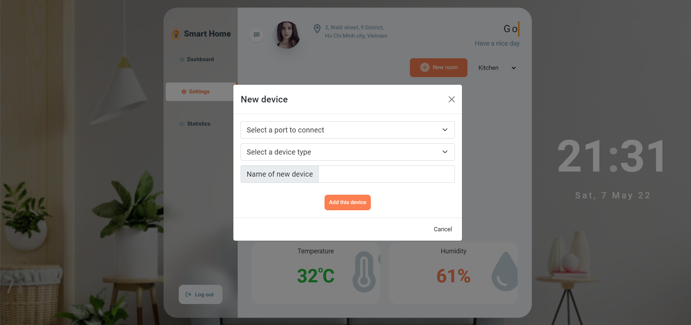
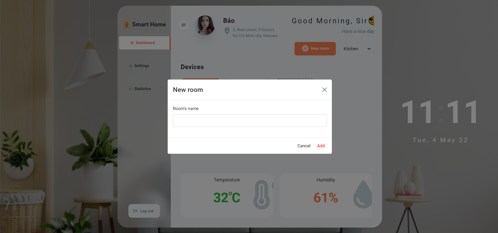
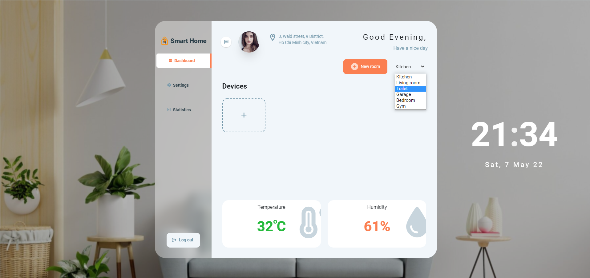
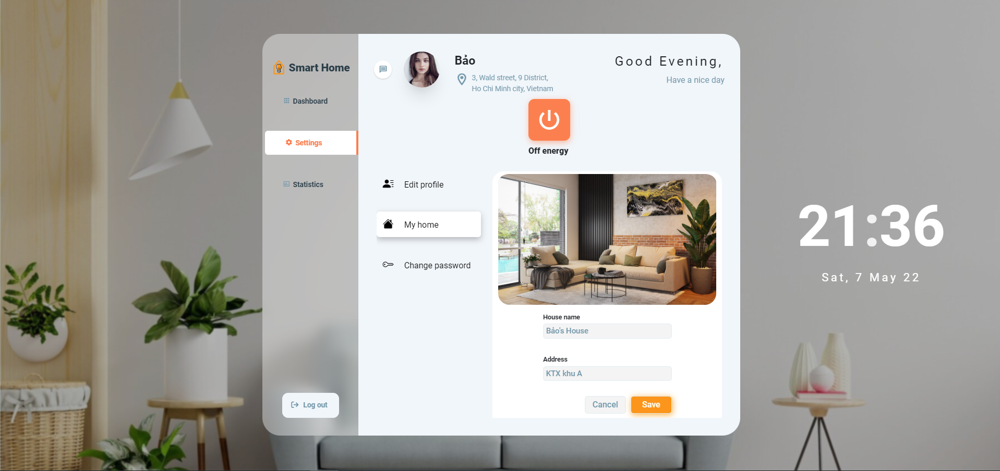
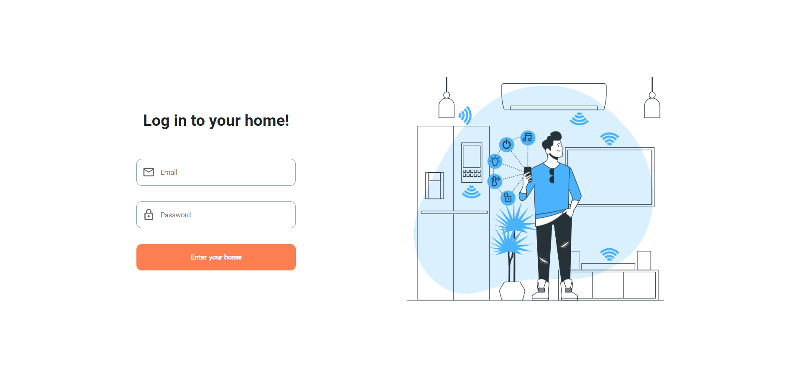
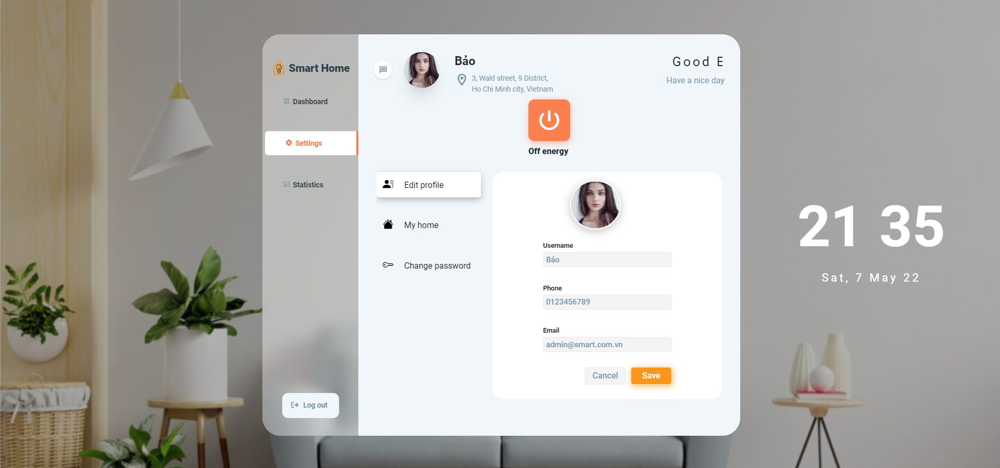
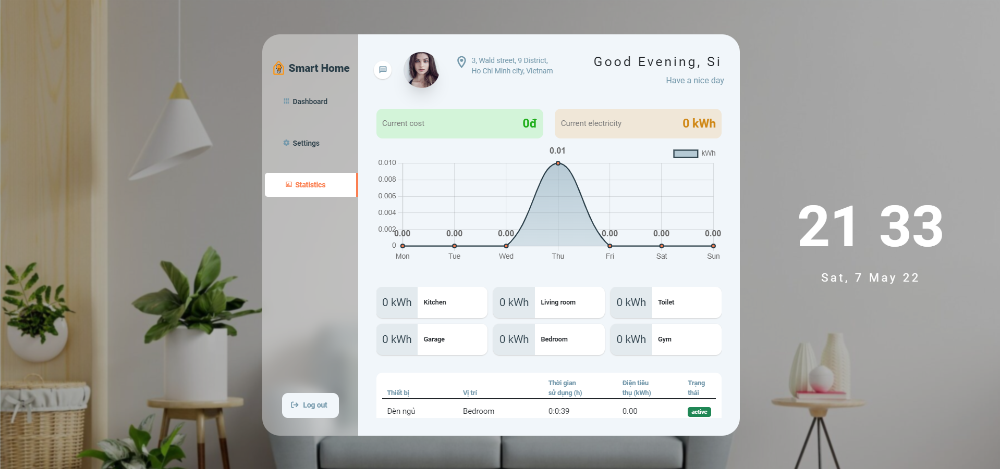

# SMART HOME WEB APPLICATION
Đây là ứng dụng web giúp điều khiển các thiết bị thông minh trong nhà
## Công nghệ sử dụng


<br><br>

## Ảnh chụp dự án

*Thêm thiết bị*
<br><br>


*Thêm phòng mới*
<br><br>


*Chọn phòng khác*
<br><br>


*Thông tin ngôi nhà*
<br><br>


*Màn hình đăng nhập*
<br><br>


*Màn hình cài đặt*
<br><br>


*Màn hình thống kê*
<br><br>

## Tài khoản mặc định dùng thử
```javascript
email: admin@smart.com.vn
password: adminS1
```

Video demo project:
[Demo Smart home control](https://youtu.be/EL-uwPF1VJY)
<br><br>
### Ghi chú: Hiện tại dự án không thể chạy được do không có database và thiết bị phần cứng hoạt động. Vui lòng xem video demo để biết ứng dụng hoạt động như thế nào. Cảm ơn❤